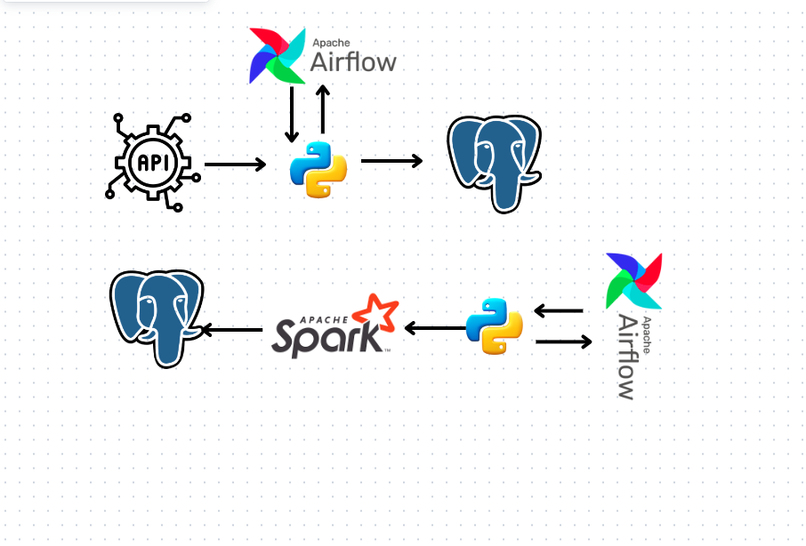
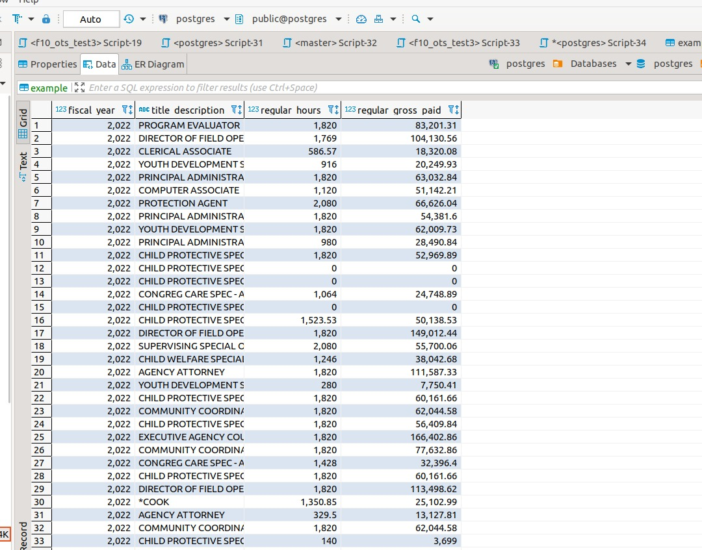

# Airflow-Spark-End-to-End-Basic-Project
# ETL Pipeline with Apache Airflow and Apache Spark

In this project, we demonstrate how to build an ETL (Extract, Transform, Load) pipeline using Apache Airflow and Apache Spark. The objective of this pipeline is to retrieve data from an API, apply basic text transformations to specific columns, and insert the transformed data into a database.

## Prerequisites

Before getting started, ensure that you have the following components set up:

- **Apache Airflow:** Install and configure Apache Airflow on your server. You can follow the official documentation for installation instructions.

- **Apache Spark:** Install Apache Spark on your system. You'll also need to have Apache Spark's `pyspark` library installed.

- **Database:** Set up a database where you'll store the transformed data. You can use PostgreSQL, MySQL, or any other database system of your choice.

## Project Structure

Here's the basic structure of our project:

- `dags/`: This directory contains the Apache Airflow DAG (Directed Acyclic Graph) that defines the ETL workflow.

- `scripts/`: Here, you'll find Python scripts used for data extraction, transformation, and loading.

## Workflow Steps

### 1. Data Extraction (API)

- Create a Python script in the `scripts/` directory to fetch data from the API. You can use libraries like `requests` to make API requests.

- Schedule this script to run periodically using an Apache Airflow Operator. You can create a custom Operator or use the `PythonOperator`.

### 2. Data Transformation (Spark)

- Write a Spark job in the `scripts/` directory to perform the necessary data transformations. For example, you can clean and format text columns, perform calculations, or filter data.

- Use the `pyspark` library to submit this Spark job from within an Apache Airflow task. You can use the `SparkSubmitOperator` for this purpose.

### 3. Data Loading (Database)

- Create a Python script in the `scripts/` directory to insert the transformed data into your database. You can use an ORM (Object-Relational Mapping) library like SQLAlchemy to interact with the database.

- Schedule this script to run as an Apache Airflow task after the transformation step is complete.

## Apache Airflow DAG

Define an Apache Airflow DAG in the `dags/` directory that orchestrates the entire ETL process. This DAG will include tasks for data extraction, Spark transformation, and data loading. You can set up task dependencies to ensure the workflow runs in the desired order.

## Running the ETL Pipeline

1. **Start Apache Airflow:** Launch the Airflow web UI and scheduler using the command `airflow webserver -p 8080` and `airflow scheduler`.

2. **Trigger the DAG:** Manually trigger the ETL DAG or set up a schedule for it to run at specific intervals.

3. **Monitor the Workflow:** Use the Airflow web UI to monitor the progress of your ETL pipeline. You can view logs, task statuses, and execution history.

4. **Database Updates:** Check your database to verify that the transformed data has been successfully inserted.

By following this project structure and workflow, you can create a robust ETL pipeline that retrieves data from an API, applies transformations using Apache Spark, and stores the results in a database. This example showcases the power of Apache Airflow and Spark in automating data processing tasks.

